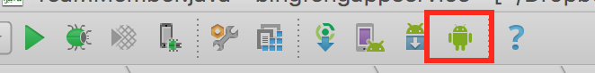
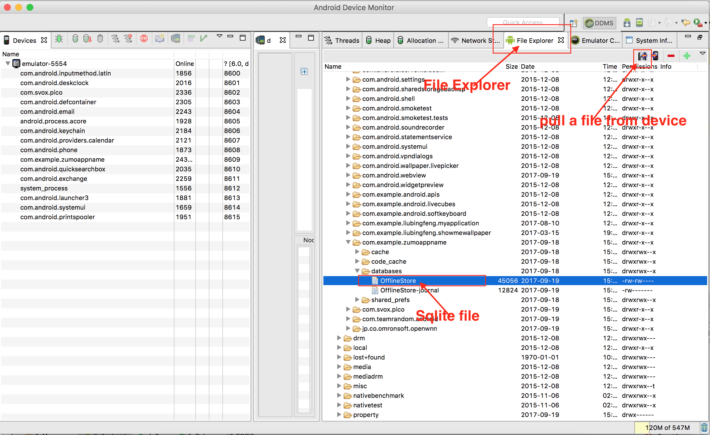
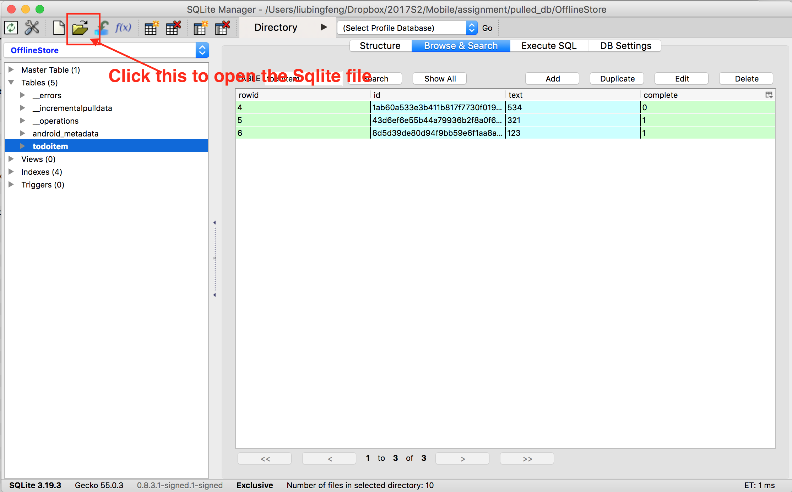

# How to examine Android Sqlite file

## First Step

In your Android Studio, click the `Android Device Monitor` icon (inside the red square)

## Second Step

After clicked the `Android Device Monitor` icon, you will see the following window popped up

1. Click File Explorer
2. Go to data/data/com.example.yourandroidappname/databases
3. Select the sqlite files under your Android app databases folder
4. Click the 'pull a file from device' icon to save the sqlite file to your local file system

## Final Step

1. You could download the Firefox sqlite-manager add-ons in here:
https://addons.mozilla.org/en-US/firefox/addon/sqlite-manager/

2. After downloaded and installed the firefox sqlite-manager add-ons, on the top menu panel of Firefox go to `Tools -> SQLite Manager`

3. Once you opened the SQLite Manager you will see the following window and use it to open the sqlite file
that you just pulled from the android device.

